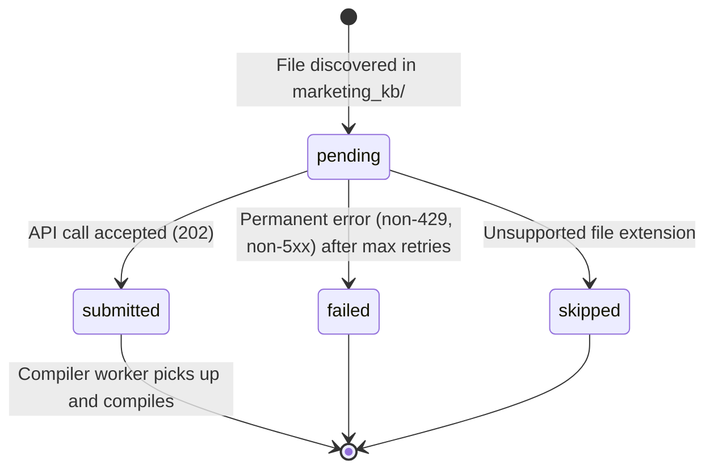
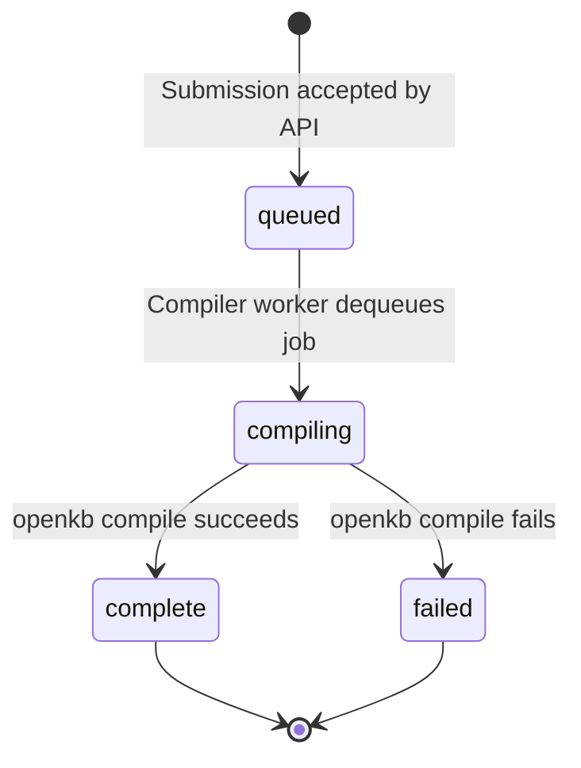

# Data Model: FastMCP Knowledge Base Server

**Phase**: 1 — Design
**Branch**: `feature/009-fastmcp-kb-server`
**Date**: 2026-06-26

---

## Entities

### KBSummary (MCP tool output — read from DB)

Represents a knowledge base that has at least one compiled document. This is the shape returned by `list_kbs`.

| Field | Type | Source | Notes |
|---|---|---|---|
| `id` | `str` (UUID) | `knowledge_bases.id` | Used as `kb_id` argument to `ask_kb` |
| `name` | `str` | `knowledge_bases.slug` | Human-readable identifier |
| `document_count` | `int` | `COUNT(documents WHERE status='complete')` | Indicates content depth |
| `ready` | `bool` | `document_count > 0` | Shorthand readiness flag for agents |

**Validation**: `id` must be a valid UUID string. `document_count` is non-negative.

---

### KBAnswer (MCP tool output — forwarded from generator-api)

Represents the result of an `ask_kb` tool call.

| Field | Type | Source | Notes |
|---|---|---|---|
| `answer` | `str` | `generator_api.QueryResponse.answer` | The grounded LLM answer |
| `citations` | `list[Any]` | `generator_api.QueryResponse.citations` | Source references from the compiled wiki |
| `tokens_used` | `int` | `generator_api.QueryResponse.tokens_used` | Token budget accounting |
| `kb_id` | `str` | echoed from request | Allows agent to correlate response to KB |

---

### AskKBInput (MCP tool input — validated by FastMCP/Pydantic)

| Field | Type | Constraint | Notes |
|---|---|---|---|
| `kb_id` | `str` | valid UUID format, non-empty | Validated via `uuid.UUID(kb_id)` |
| `question` | `str` | 1–8,000 chars (stripped) | Parity with generator-api validation |

---

### IngestionRecord (in-memory only — ingestion script)

Tracks per-document ingestion state during the one-shot script run.

| Field | Type | Notes |
|---|---|---|
| `file_path` | `Path` | Absolute path to source document |
| `relative_path` | `str` | Relative to `--kb-dir`; used as display name |
| `document_id` | `str \| None` | Set after DB insertion |
| `status` | `Literal["pending", "submitted", "failed", "skipped"]` | Tracks script progress |
| `failure_reason` | `str \| None` | Human-readable error if `status == "failed"` |
| `retry_count` | `int` | Total retry attempts consumed |

---

## State Transitions

### Document Ingestion Flow



### Compilation Status (existing DB — compiler_worker owns)



---

## Database Queries

### `list_kbs` — Ready knowledge bases

```sql
SELECT
    kb.id,
    kb.slug,
    COUNT(d.id) AS document_count
FROM knowledge_bases kb
JOIN documents d ON d.kb_id = kb.id
    AND d.status = 'complete'
    AND d.deleted_at IS NULL
WHERE kb.deleted_at IS NULL
GROUP BY kb.id, kb.slug
HAVING COUNT(d.id) > 0
ORDER BY kb.slug;
```

### `ask_kb` pre-flight — KB existence and readiness

```sql
-- Same query pattern as generator_api/router.py (reused via generator-api HTTP call)
-- The MCP server does NOT query the DB directly; it delegates to generator-api.
```

---

## No New Database Tables

This feature introduces **no new tables**. It reads from existing `knowledge_bases` and `documents` tables via:
1. Direct async DB query for `list_kbs` (read-only).
2. Delegation to `generator-api` HTTP endpoint for `ask_kb`.

The ingestion script uses the existing `openkb-core` API (`POST /kbs`, `POST /kbs/{id}/documents`) to register and enqueue documents.
