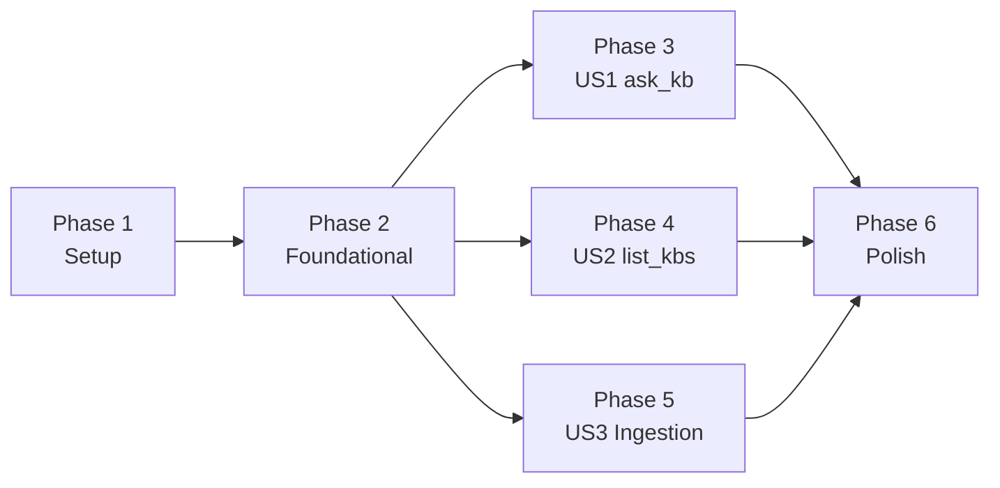

# Tasks: FastMCP Knowledge Base Server

**Input**: Design documents from `specs/009-fastmcp-kb-server/`
**Branch**: `feature/009-fastmcp-kb-server`
**Date**: 2026-06-26

## Format: `[ID] [P?] [Story?] Description`

- **[P]**: Can run in parallel (different files, no dependencies on incomplete tasks)
- **[US1]**: User Story 1 — Query KB via MCP (`ask_kb` tool) — P1
- **[US2]**: User Story 2 — Discover available KBs (`list_kbs` tool) — P2
- **[US3]**: User Story 3 — Ingest marketing documents without rate-limit failures — P3

---

## Phase 1: Setup

**Purpose**: Gitignore, dependency declarations, and package skeleton — no business logic.

- [ ] T001 Add `marketing_kb/` entry to `.gitignore` at repository root
- [ ] T002 Add `[project.optional-dependencies.mcp]` to `pyproject.toml` with `fastmcp==3.4.2` and `tenacity==9.1.2`; add `httpx==0.28.1` to the `mcp` extra (already in `dev`; pin same version); run `uv sync --extra mcp` and commit `uv.lock`
- [ ] T003 [P] Create `mcp_server/__init__.py` (set `__version__ = "0.1.0"`) and `mcp_server/__main__.py` (calls `uvicorn mcp_server.app:http_app --host 0.0.0.0 --port {MCP_PORT}` via `subprocess` or `uvicorn.run`)
- [ ] T004 [P] Create `mcp_server/exceptions.py` with three custom exceptions: `KBNotFoundError(kb_id: str)`, `KBNotReadyError(kb_id: str)`, `GeneratorAPIError(message: str, status_code: int)`
- [ ] T005 [P] Create `mcp_server/config.py` using `pydantic-settings` `BaseSettings`: fields `database_url: str`, `generator_api_url: str`, `mcp_host: str = "0.0.0.0"`, `mcp_port: int = 8002`, `query_timeout_s: float = 300.0`, `list_kbs_timeout_s: float = 10.0`; `model_config = {"env_file": ".env", "extra": "ignore"}`; `@lru_cache(maxsize=1)` factory `get_settings()`

---

## Phase 2: Foundational (Blocking Prerequisites)

**Purpose**: Docker plumbing, shared DB session, and the bare FastMCP ASGI app. Must be fully working before any tool implementation.

**CRITICAL**: No tool implementation can begin until `docker compose up mcp-server --wait` passes and `/health` responds.

- [ ] T006 Create `mcp_server/db.py`: async SQLAlchemy engine via `create_async_engine(settings.database_url)`; `AsyncSession` factory; `get_session()` async context manager — mirrors `generator_api/db.py` structure
- [ ] T007 Create `mcp_server/tools/__init__.py` (empty — package marker only)
- [ ] T008 Create `mcp_server/app.py` with: `@lifespan` async context manager that initialises a single `httpx.AsyncClient(base_url=settings.generator_api_url, timeout=...)` and yields `{"http_client": client}`; `mcp = FastMCP("OpenKB", instructions="...", lifespan=_app_lifespan)`; static `@mcp.custom_route("/health", methods=["GET"])` returning `JSONResponse({"status": "ok", "generator_api": "unchecked"}, 200)`; `http_app = mcp.http_app(path="/mcp")` at module level
- [ ] T009 Create `Dockerfile.mcp-server`: multi-stage build matching the pattern in `Dockerfile.generator-api`; base `python:3.12-slim`; install project with `uv sync --extra mcp --no-dev`; non-root `openkb` user; `CMD ["uvicorn", "mcp_server.app:http_app", "--host", "0.0.0.0", "--port", "8002"]`
- [ ] T010 Add `mcp-server` service to `docker-compose.yml`: image built from `Dockerfile.mcp-server`; port `8002:8002`; `env_file: .env`; env overrides for `DATABASE_URL` and `GENERATOR_API_URL`; `depends_on: postgres: condition: service_healthy` and `generator-api: condition: service_healthy`; `healthcheck: test: ["CMD", "curl", "-sf", "http://localhost:8002/health"]`; `restart: unless-stopped`
- [ ] T011 [P] Scaffold test files with passing placeholder imports: `tests/unit/test_mcp_tools_ask_kb.py`, `tests/unit/test_mcp_tools_list_kbs.py`, `tests/integration/test_mcp_server_http.py` — each contains `from __future__ import annotations` header, logger, and one `@pytest.mark.skip("not implemented")` test stub
- [ ] T012 Verify Phase 2 checkpoint locally: `docker compose build mcp-server && docker compose up mcp-server --wait` completes healthy; `curl -s http://localhost:8002/health | python3 -m json.tool` returns `{"status": "ok"}`; `uv run pytest tests/unit/test_mcp_tools_ask_kb.py tests/unit/test_mcp_tools_list_kbs.py -v` runs without import errors

**Checkpoint**: Docker Compose brings up `mcp-server` healthy, bare health endpoint responds, test files import cleanly.

---

## Phase 3: User Story 1 — Query KB via MCP (Priority: P1) — MVP

**Goal**: `ask_kb` tool available via MCP HTTP; MCP hosts can invoke it and receive a grounded, citation-backed answer proxied from `generator-api`.

**Independent Test**: Configure any MCP host against `http://localhost:8002/mcp`; call `ask_kb` with a valid `kb_id` and question; assert a non-empty answer with citations is returned. Can also be verified with `uvx fastmcp run http://localhost:8002/mcp -- ask_kb '{"kb_id": "...", "question": "..."}'`.

- [ ] T013 Implement `mcp_server/tools/ask_kb.py`: define `AskKBInput` validation helpers (`_validate_kb_id(kb_id: str)` using `uuid.UUID(kb_id, version=4)`, `_validate_question(q: str)` enforcing 1–8000 chars stripped); define `KBAnswer` dataclass with fields `answer: str`, `citations: list[Any]`, `tokens_used: int`, `kb_id: str`; implement `async def ask_kb(kb_id: str, question: str, ctx: Context) -> KBAnswer` — validates inputs, retrieves `http_client` from `ctx.lifespan_context["http_client"]`, calls `POST /kbs/{kb_id}/query` with `{"question": question}`, maps HTTP 404→`KBNotFoundError`, 409→`KBNotReadyError`, timeout→`GeneratorAPIError("timed out")`, 5xx→`GeneratorAPIError`, returns `KBAnswer`; decorate with `@tool(annotations=ToolAnnotations(readOnlyHint=True, idempotentHint=True, openWorldHint=True))` from `fastmcp.tools`
- [ ] T014 [US1] Register `ask_kb` in `mcp_server/app.py` via `mcp.add_tool(ask_kb_fn, name="ask_kb", description="Query a compiled knowledge base with a natural-language question. Use list_kbs to find available kb_id values.")` after `mcp` instance creation; add `MCPError` exception handler mapping `KBNotFoundError`→`INVALID_PARAMS`, `KBNotReadyError`→`INVALID_PARAMS`, `GeneratorAPIError`→`INTERNAL_ERROR`
- [ ] T015 [US1] Update `@mcp.custom_route("/health")` in `mcp_server/app.py` to perform a live `GET {settings.generator_api_url}/health` via the lifespan `http_client`; return `{"status": "ok"|"degraded", "generator_api": "ok"|"error", "detail": null|"<message>"}` with HTTP 200 or 503 accordingly; handle `httpx.ConnectError` and `httpx.TimeoutException` gracefully
- [ ] T016 [P] [US1] Write unit tests for `ask_kb` in `tests/unit/test_mcp_tools_ask_kb.py` covering: valid call returns `KBAnswer`; blank question raises `ValueError`; question >8000 chars raises `ValueError`; non-UUID `kb_id` raises `ValueError`; `generator-api` 404 response maps to `KBNotFoundError`; `generator-api` 409 maps to `KBNotReadyError`; `httpx.TimeoutException` maps to `GeneratorAPIError`; use `respx` or `unittest.mock` to mock `httpx.AsyncClient`
- [ ] T017 [P] [US1] Write integration test in `tests/integration/test_mcp_server_http.py`: use `httpx.AsyncClient` + FastMCP's `ASGITransport` to call the MCP `initialize` and `tools/list` endpoints against `http_app`; assert `ask_kb` appears in the tool list with correct `inputSchema`; mock `generator-api` call with `respx` and assert `tools/call` for `ask_kb` returns `{"answer": "...", "citations": [...], "tokens_used": 0, "kb_id": "..."}`

**Checkpoint**: `uv run pytest tests/unit/test_mcp_tools_ask_kb.py tests/integration/test_mcp_server_http.py -v` all pass. `ask_kb` is listed when calling `GET http://localhost:8002/mcp` tools endpoint.

---

## Phase 4: User Story 2 — Discover Available KBs (Priority: P2)

**Goal**: `list_kbs` tool available via MCP HTTP; MCP hosts can enumerate ready knowledge bases before querying.

**Independent Test**: Call `list_kbs` with no arguments against the running stack with at least one compiled KB; assert response is a list with at least one entry containing `id`, `name`, `document_count >= 1`, `ready: true`. Verify with `uvx fastmcp run http://localhost:8002/mcp -- list_kbs '{}'`.

- [ ] T018 [P] [US2] Implement `mcp_server/tools/list_kbs.py`: define `KBSummary` dataclass with fields `id: str`, `name: str`, `document_count: int`, `ready: bool`; implement `async def list_kbs(ctx: Context) -> list[KBSummary]` — opens `async with get_session() as session`, executes the aggregation query (SELECT `knowledge_bases.id`, `knowledge_bases.slug`, `COUNT(documents.id)` WHERE `status='complete'` AND `deleted_at IS NULL` GROUP BY HAVING `COUNT > 0`), maps rows to `KBSummary(ready=True)`; wraps `SQLAlchemyError` as `GeneratorAPIError`; decorate with `@tool(annotations=ToolAnnotations(readOnlyHint=True, idempotentHint=True, openWorldHint=False))`
- [ ] T019 [US2] Register `list_kbs` in `mcp_server/app.py` via `mcp.add_tool(list_kbs_fn, name="list_kbs", description="List all knowledge bases with at least one compiled document. Returns id, name, document_count, and ready status.")`
- [ ] T020 [P] [US2] Write unit tests for `list_kbs` in `tests/unit/test_mcp_tools_list_kbs.py`: mock `get_session()` returning zero rows → empty list; mock returning two rows → two `KBSummary` objects with correct field mapping; mock `SQLAlchemyError` → `GeneratorAPIError`; verify `ready=True` always set
- [ ] T021 [P] [US2] Extend integration test in `tests/integration/test_mcp_server_http.py`: assert `list_kbs` appears in `tools/list` response with empty `inputSchema` (no required args); call `tools/call` for `list_kbs` with mock DB session returning one row, assert response matches `KBSummary` schema

**Checkpoint**: `uv run pytest tests/unit/test_mcp_tools_list_kbs.py tests/integration/test_mcp_server_http.py -v` all pass. Both `ask_kb` and `list_kbs` appear in MCP tools list.

---

## Phase 5: User Story 3 — Ingest Marketing Documents Without Rate-Limit Failures (Priority: P3)

**Goal**: `scripts/ingest_marketing_kb.py` successfully submits all documents from `marketing_kb/` to the compiler pipeline with exponential-backoff retry and concurrency control. No permanent 429 failures.

**Independent Test**: Run `uv run python scripts/ingest_marketing_kb.py --kb-dir marketing_kb/ --kb-name marketing`; observe all documents reach `submitted` status in script output; watch `docker compose logs compiler-worker` until at least one document reaches `complete` in the database.

- [ ] T022 [US3] Create `scripts/ingest_marketing_kb.py` skeleton: `from __future__ import annotations`; `argparse` CLI with `--kb-dir` (Path, required), `--kb-name` (str, default `"marketing"`), `--concurrency` (int, default 3), `--api-url` (str, default `http://localhost:8000`); `logging.basicConfig` setup; file discovery via `pathlib.Path(kb_dir).rglob("*")` filtering `.docx`, `.pptx`, `.pdf`, `.txt`, `.md` extensions; print discovered file count; main `asyncio.run(main())` entry; `if __name__ == "__main__"` guard
- [ ] T023 [US3] Implement KB creation logic in `scripts/ingest_marketing_kb.py`: `async def ensure_kb_exists(client: httpx.AsyncClient, kb_name: str) -> str` — calls `GET /kbs` to find existing KB by slug; calls `POST /kbs` with `{"name": kb_name}` if not found; returns the KB UUID string; raise `RuntimeError` on unexpected HTTP errors
- [ ] T024 [US3] Implement per-document submission with retry and throttle in `scripts/ingest_marketing_kb.py`: define `is_rate_limit_or_server_error(exc: Exception) -> bool` returning `True` for `httpx.HTTPStatusError` with status 429 or >= 500; decorate `async def submit_document(client, kb_id, file_path, semaphore)` with `@tenacity.retry(wait=wait_exponential(multiplier=2, min=2, max=60), stop=stop_after_attempt(5), retry=retry_if_exception(is_rate_limit_or_server_error), reraise=True)`; inside function: acquire `semaphore`, sleep `0.2` seconds, open file in binary mode, `POST /kbs/{kb_id}/documents` with multipart upload, release semaphore; catch non-retryable errors and mark record as `failed`; use `asyncio.gather(*[submit_document(...) for f in files])` with `return_exceptions=True` for concurrent fan-out
- [ ] T025 [US3] Implement summary reporting and exit code in `scripts/ingest_marketing_kb.py`: collect `IngestionRecord` dataclass results (`file_path`, `status: Literal["submitted","failed","skipped"]`, `failure_reason: str|None`); print formatted table to stdout; log totals at `INFO` level; `sys.exit(1)` if any permanent failures, `sys.exit(0)` otherwise
- [ ] T026 [US3] Validate ingestion script end-to-end: run `uv run python scripts/ingest_marketing_kb.py --kb-dir marketing_kb/ --kb-name marketing` against the full running Compose stack; confirm all supported documents in `marketing_kb/` appear as `submitted`; confirm `docker compose logs compiler-worker` shows documents being picked up; confirm at least one document reaches `complete` status (query: `SELECT COUNT(*) FROM documents WHERE status='complete'`)

**Checkpoint**: All `marketing_kb/` documents submitted with zero permanent 429 failures. Compiler worker progressively moves documents to `complete`.

---

## Phase 6: Polish and Cross-Cutting Concerns

**Purpose**: Quality gate validation, documentation linkage, and PR readiness.

- [ ] T027 [P] Audit all new `mcp_server/` modules and `scripts/ingest_marketing_kb.py`: confirm `from __future__ import annotations` is present in every file; confirm `logger = logging.getLogger(__name__)` is the only logging mechanism (no `print()` statements in library code); fix any violations
- [ ] T028 Update `docs/index.md` to link to `specs/009-fastmcp-kb-server/quickstart.md`; add a brief "MCP Server" section describing the two tools and the port 8002 endpoint; verify no broken links in `docs/`
- [ ] T029 [P] Run the full quality gate: `uv run ruff check . && uv run ruff format --check . && uv run bandit -r . && uv run pytest`; resolve every lint, format, and bandit finding; confirm all tests pass
- [ ] T030 Validate the full local stack end-to-end per `specs/009-fastmcp-kb-server/quickstart.md`: `docker compose up --wait`; `curl http://localhost:8002/health`; connect one MCP host (Claude Desktop or Cursor) to `http://localhost:8002/mcp`; call `list_kbs` and `ask_kb` from the host UI; confirm grounded answer with citations is returned; open PR against `develop` with description referencing this feature spec

---

## Dependencies and Execution Order

### Phase Dependencies



- **Phase 1** (Setup): No dependencies — start immediately.
- **Phase 2** (Foundational): Depends on Phase 1 completion — blocks all user story phases.
- **Phase 3, 4, 5** (User Stories): All depend only on Phase 2 — can proceed in parallel once Phase 2 is done.
- **Phase 6** (Polish): Depends on all user story phases complete.

### Within Phase 2

| Task | Depends On |
|---|---|
| T006 (`db.py`) | T005 (`config.py`) |
| T007 (`tools/__init__`) | T003 (`mcp_server/__init__`) |
| T008 (`app.py`) | T004, T005, T006, T007 |
| T009 (`Dockerfile`) | T002 |
| T010 (Compose) | T009 |
| T011 (test stubs) | T003 |
| T012 (checkpoint) | T010 + T011 |

### Within Phase 3 (US1)

| Task | Depends On |
|---|---|
| T013 (`ask_kb.py` implementation) | T004, T005 (exceptions, config) |
| T014 (register `ask_kb`) | T008, T013 |
| T015 (update health route) | T008, T014 |
| T016 (unit tests) | T013 — can be written before T014 |
| T017 (integration test) | T014, T015 |

### Within Phase 4 (US2)

| Task | Depends On |
|---|---|
| T018 (`list_kbs.py`) | T004, T005, T006 |
| T019 (register `list_kbs`) | T008, T018 |
| T020 (unit tests) | T018 |
| T021 (integration test) | T019 |

### Within Phase 5 (US3)

| Task | Depends On |
|---|---|
| T022 (skeleton) | T002 (`tenacity` installed) |
| T023 (KB creation) | T022 |
| T024 (submission + retry) | T022, T023 |
| T025 (reporting) | T024 |
| T026 (end-to-end validation) | T025 + running Compose stack |

---

## Parallel Opportunities

### Phase 1 — all three can run simultaneously

```
T003 (package skeleton)   ──┐
T004 (exceptions.py)       ─┤─▶ all done ──▶ T006 (db.py) ──▶ T008 (app.py)
T005 (config.py)           ─┘
```

### After Phase 2 checkpoint (T012) — three stories in parallel

```
T012 (checkpoint)
  ├──▶ T013-T017 (US1 ask_kb)
  ├──▶ T018-T021 (US2 list_kbs)
  └──▶ T022-T026 (US3 ingestion)
```

### Within US1 — tests and implementation in parallel

```
T013 (implement ask_kb.py)
  ├──▶ T014 (register tool) ──▶ T015 (health route) ──▶ T017 (integration test)
  └──▶ T016 (unit tests) ─────────────────────────────────────────────────────┘
```

---

## Implementation Strategy

### MVP: User Story 1 Only (ask_kb)

1. Complete **Phase 1** (Setup) — ~30 min
2. Complete **Phase 2** (Foundational) — ~1 h; validate `docker compose up mcp-server --wait`
3. Complete **Phase 3** (US1 — ask_kb) — ~2 h
4. **Stop and validate**: configure Claude Desktop or Cursor → call `ask_kb` → see answer with citations
5. Demo to stakeholders if desired

### Incremental Delivery

1. Phase 1 + 2 → bare MCP server container healthy
2. Phase 3 (US1) → `ask_kb` working → MVP demo possible
3. Phase 4 (US2) → `list_kbs` working → full agent-discoverable MCP server
4. Phase 5 (US3) → marketing KB fully compiled → real-world content validation
5. Phase 6 → quality gates pass → PR to `develop`

---

## Notes

- `[P]` tasks have no file conflicts with other parallel tasks in the same phase — safe to run concurrently.
- `[Story]` labels trace every task back to its user story for independent delivery validation.
- Tests (T016, T017, T020, T021) are implementation tests not TDD — no need to write-and-fail-first.
- T026 (ingestion end-to-end) requires a live stack with `LLM_API_KEY` set — not part of CI.
- US1 and US2 are independently testable with mocked DB/HTTP in unit and integration tests.
- US3 (ingestion) is an operational task — no automated tests are required; validation is manual.
