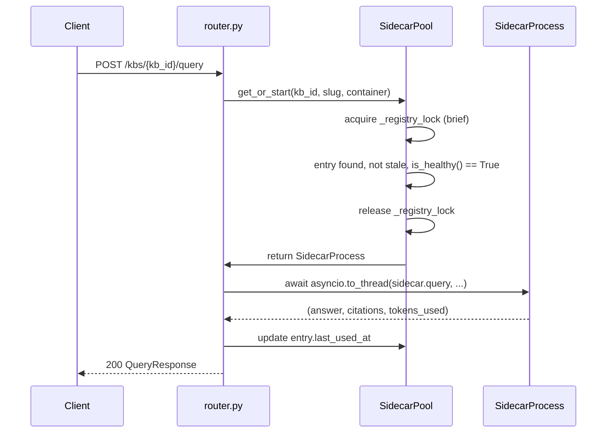
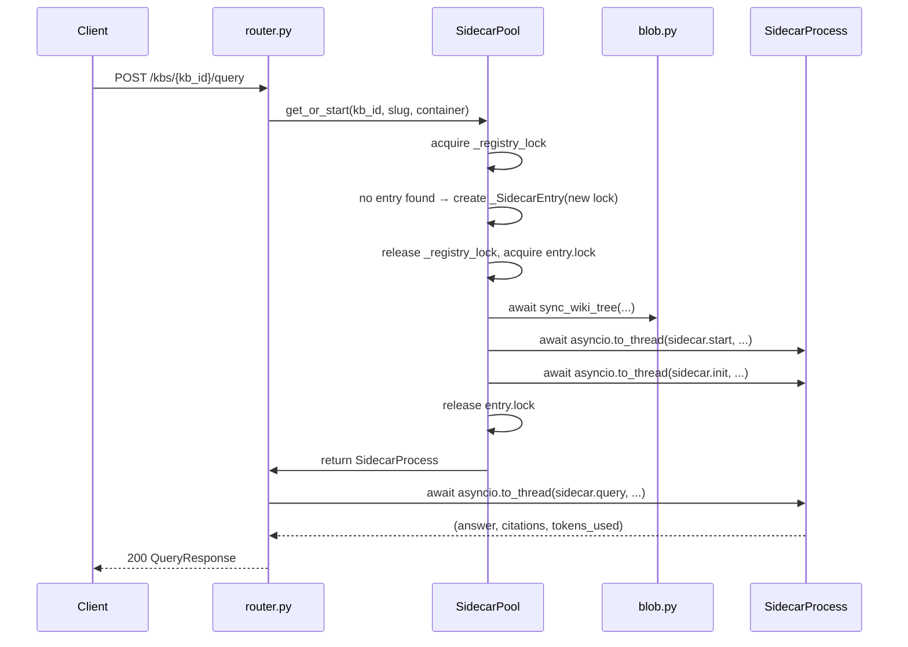
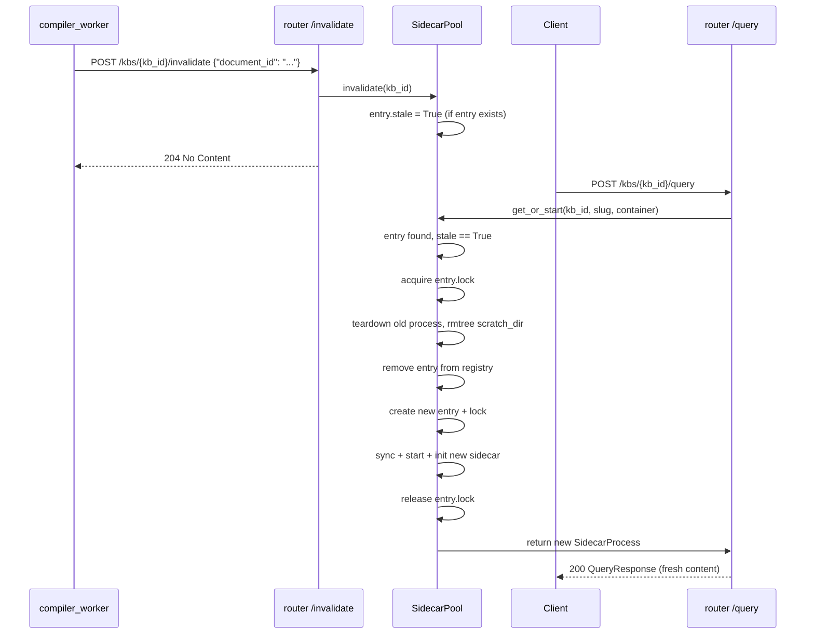
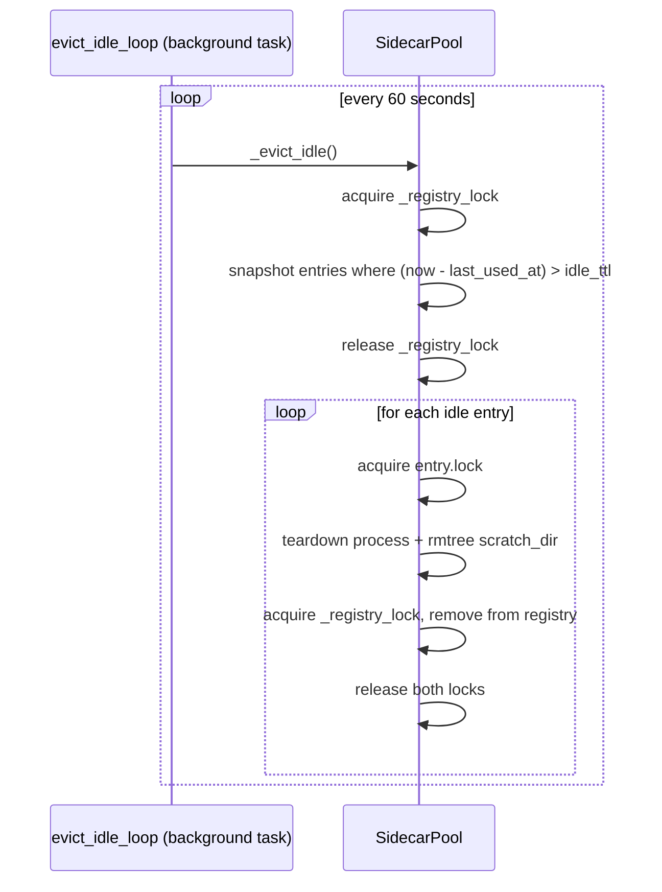

# Data Model: Persistent KB Sidecar Pool

**Feature**: 010-persistent-kb-sidecar-pool
**Phase**: 1 — Design
**Date**: 2026-06-26

---

## Overview

This feature introduces no new database tables or schema changes. All persistent state lives in
the existing `knowledge_bases` and `documents` tables (unchanged). The new data structures are
purely in-process, owned by `SidecarPool` in `generator_api/pool.py`.

---

## In-Process Entities

### `_SidecarEntry` (dataclass — `generator_api/pool.py`)

Internal entry in the pool registry. One instance per KB that has been started or is starting.

```python
from __future__ import annotations

import asyncio
import dataclasses
import time

from generator_api.sidecar import SidecarProcess


@dataclasses.dataclass
class _SidecarEntry:
    process: SidecarProcess
    lock: asyncio.Lock           # Serialises start/stop for this KB
    stale: bool = False          # True after invalidate() or crash detection
    last_used_at: float = dataclasses.field(default_factory=time.monotonic)
```

| Field | Type | Nullable | Description |
|-------|------|----------|-------------|
| `process` | `SidecarProcess` | No | The sidecar process wrapper; may be in starting/ready/stopped state |
| `lock` | `asyncio.Lock` | No | Per-KB lock; acquired during start, stop, and health check |
| `stale` | `bool` | No | When `True`, the next `get_or_start()` call triggers teardown + restart |
| `last_used_at` | `float` | No | `time.monotonic()` timestamp of last successful query; used for idle eviction |

**Validation rules**:
- `last_used_at` is set at `_SidecarEntry` creation and updated after each successful query.
- `stale` is set to `True` by `invalidate()` and by crash detection; never set back to `False`
  on the same entry (the entry is replaced by a fresh one on restart).

---

### `SidecarPool` (class — `generator_api/pool.py`)

```python
from __future__ import annotations

import asyncio
import logging
import shutil
import time
from pathlib import Path

from generator_api.config import Settings
from generator_api.sidecar import SidecarProcess

logger = logging.getLogger(__name__)


class SidecarPool:
    def __init__(self, settings: Settings) -> None:
        self._settings = settings
        self._registry: dict[str, _SidecarEntry] = {}
        self._registry_lock = asyncio.Lock()

    async def get_or_start(
        self,
        kb_id: str,
        kb_slug: str,
        container: str,
    ) -> SidecarProcess: ...

    async def invalidate(self, kb_id: str) -> None: ...

    async def evict_idle_loop(self) -> None: ...

    async def shutdown(self) -> None: ...

    # Private helpers
    async def _start_entry(self, kb_id: str, kb_slug: str, container: str) -> _SidecarEntry: ...
    async def _stop_entry(self, kb_id: str, entry: _SidecarEntry, reason: str) -> None: ...
    async def _evict_idle(self) -> None: ...
```

**State machine for a single `_SidecarEntry`**:

```
                 get_or_start() ──────────────────► STARTING
                                                        │
                                            start() + init() succeed
                                                        │
                                                        ▼
  query arrives ─────────────────────────────────► READY ◄── update last_used_at
                                                        │
                 invalidate() or crash detection        │
                                                        ▼
                                                      STALE
                                                        │
                                    next get_or_start() call arrives
                                                        │
                                            teardown + rmtree
                                                        │
                                                        ▼
                                                   (removed from registry)
                                                        │
                                            new entry STARTING
```

```
  idle TTL exceeded ──────► EVICTED (stop + rmtree + removed from registry)
  shutdown signal ─────────► SHUTDOWN (all entries: stop + removed from registry)
```

**Concurrency contract**:

1. `_registry_lock` is held for the minimum time needed to insert/lookup/delete entries.
2. `entry.lock` is held during the entire sidecar start or stop sequence.
3. `entry.lock` is NEVER acquired while `_registry_lock` is held (prevents deadlock).
4. Multiple concurrent `get_or_start()` calls for the same `kb_id` will all wait on
   `entry.lock`; only the first one drives the actual startup.

---

### Modified: `SidecarProcess` (`generator_api/sidecar.py`)

Two additions to the existing class:

```python
class SidecarProcess:
    def __init__(self) -> None:
        self._process: subprocess.Popen | None = None
        self._port: int | None = None
        self._base_url: str | None = None
        self.last_used_at: float = time.monotonic()   # NEW — updated after each query

    def is_healthy(self) -> bool:                      # NEW — non-blocking process check
        """Return True if the subprocess is still alive."""
        return self._process is not None and self._process.poll() is None
```

**Validation rules**:
- `is_healthy()` must be callable on a not-yet-started `SidecarProcess` (returns `False`).
- `last_used_at` is updated by the pool after each successful `query()` call, not by
  `SidecarProcess` itself (to keep the process class independent of pool semantics).

---

### Modified: `Settings` (`generator_api/config.py`)

New configuration field:

```python
class Settings(BaseSettings):
    # ... existing fields ...

    # ── Sidecar Pool ─────────────────────────────────────────────────────────
    sidecar_idle_ttl_seconds: int = 1800
    """Seconds of inactivity before a sidecar is evicted from the pool.
    Controlled by GENERATOR_SIDECAR_IDLE_TTL_SECONDS env var."""

    generator_request_timeout: int = 120
    # Changed from 300 → 120: now covers query time only; startup is separate.
    # Controlled by GENERATOR_REQUEST_TIMEOUT env var.

    prewarm_on_startup: bool = False
    """If True, pre-warms sidecars for all ready KBs on startup (background).
    Controlled by GENERATOR_PREWARM_ON_STARTUP env var."""
```

---

### Modified: `exceptions.py` (`generator_api/exceptions.py`)

New exception:

```python
class SidecarCrashedError(Exception):
    """Raised when a pool sidecar is found dead between queries."""
    def __init__(self, kb_id: str) -> None:
        super().__init__(f"Sidecar for KB {kb_id} crashed unexpectedly")
        self.kb_id = kb_id
```

---

### Modified: `models.py` (`generator_api/models.py`)

New request model for the invalidate endpoint:

```python
class InvalidateRequest(BaseModel):
    document_id: str | None = None
    """Optional document ID for logging/tracing purposes only.
    Does not affect invalidation behaviour."""
```

---

### Modified: `compiler_worker/config.py`

New configuration field:

```python
class WorkerConfig:
    # ... existing fields ...

    generator_api_url: str = "http://generator-api:8001"
    """Base URL of the generator_api service for invalidation notifications.
    Controlled by GENERATOR_API_URL env var."""
```

---

## Sequence Diagrams

### Warm query (sidecar already running)



### Cold start (no sidecar)



### Invalidate + re-query



### Idle eviction


