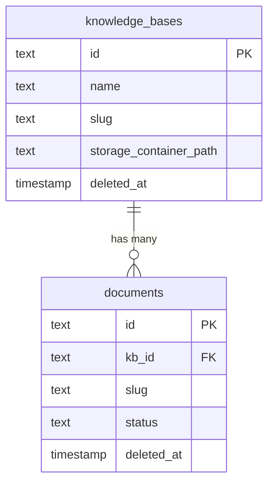
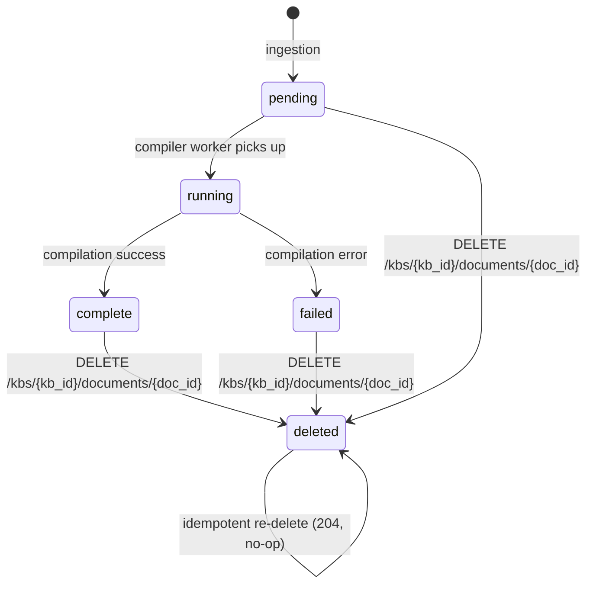

# Data Model: Delete Document Endpoint (Feature 011)

**Phase**: 1 — Design
**Branch**: `feature/011-delete-document-endpoint`
**Date**: 2026-06-27

---

## Overview

This feature does not introduce new database tables or columns. It relies on two existing tables
whose schemas already include the fields required for soft-deletion. No Alembic migration is
needed.

---

## Existing Entities

### knowledge_bases

| Column | Type | Notes |
|--------|------|-------|
| `id` | `UUID` / `TEXT` | Primary key; KB identifier |
| `name` | `TEXT` | Human-readable KB name |
| `slug` | `TEXT` | URL-safe identifier; used in sidecar paths |
| `storage_container_path` | `TEXT` / `NULL` | Override container name; falls back to `kb-{id}` |
| `compilation_config` | `JSONB` | LLM config for compiler worker |
| `status` | `TEXT` | Active state |
| `deleted_at` | `TIMESTAMP WITH TIME ZONE` / `NULL` | Soft-delete timestamp; `NULL` = active |

**Query used by this feature** (KB existence check):
```sql
SELECT id, slug, storage_container_path
FROM knowledge_bases
WHERE id = :kb_id AND deleted_at IS NULL
```

### documents

| Column | Type | Notes |
|--------|------|-------|
| `id` | `UUID` / `TEXT` | Primary key; document identifier |
| `kb_id` | `UUID` / `TEXT` | Foreign key → `knowledge_bases.id` |
| `slug` | `TEXT` | URL-safe doc identifier; used to derive summary blob path `wiki/summaries/{slug}.md` |
| `source_type` | `TEXT` | `md`, `pdf`, etc. |
| `source_uri` | `TEXT` | Blob path of the source document |
| `original_filename` | `TEXT` | Human-readable filename |
| `status` | `TEXT` | `pending`, `running`, `complete`, `failed` |
| `deleted_at` | `TIMESTAMP WITH TIME ZONE` / `NULL` | Soft-delete timestamp; `NULL` = active |

**Query used by this feature** (document ownership + delete check):
```sql
SELECT id, slug, deleted_at
FROM documents
WHERE id = :doc_id AND kb_id = :kb_id
```

**Update used by this feature** (soft-delete):
```sql
UPDATE documents
SET deleted_at = timezone('utc', NOW())
WHERE id = :doc_id
```

---

## Entity Relationships



---

## Blob Storage Layout (No Change)

The following blob structure already exists and is read/written by this feature. No new blob
paths or container conventions are introduced.

```
Container: kb-{kb_id}  (or storage_container_path value)
└── wiki/
    ├── index.md                        ← rebuilt + re-uploaded by this feature
    ├── summaries/
    │   ├── {doc_slug}.md               ← DELETED by this feature
    │   └── other-doc.md
    ├── concepts/
    │   └── *.md                        ← untouched (FR-004)
    ├── entities/
    │   └── *.md                        ← untouched (FR-004)
    └── explorations/
        └── *.md                        ← untouched (FR-004)
```

---

## State Transitions

### Document Lifecycle (relevant subset)



A document in any status can be soft-deleted. `deleted_at IS NOT NULL` is the canonical
"deleted" state. The row is retained; `status` is not changed by the delete operation.

---

## Validation Rules

| Rule | Source | Enforcement |
|------|--------|-------------|
| `kb_id` must be a valid UUID | FR-009 | FastAPI path parameter type `uuid.UUID` → 422 on invalid input |
| `doc_id` must be a valid UUID | FR-010 | FastAPI path parameter type `uuid.UUID` → 422 on invalid input |
| `kb_id` must exist and not be soft-deleted | FR-009 | DB query with `deleted_at IS NULL`; raises `KBNotFoundError` → 404 |
| `doc_id` must exist within `kb_id` | FR-010 | DB query with both `id = :doc_id AND kb_id = :kb_id`; raises `DocumentNotFoundError` → 404 |
| Already-deleted document | FR-008 | `deleted_at IS NOT NULL` check → return early with no storage ops |
